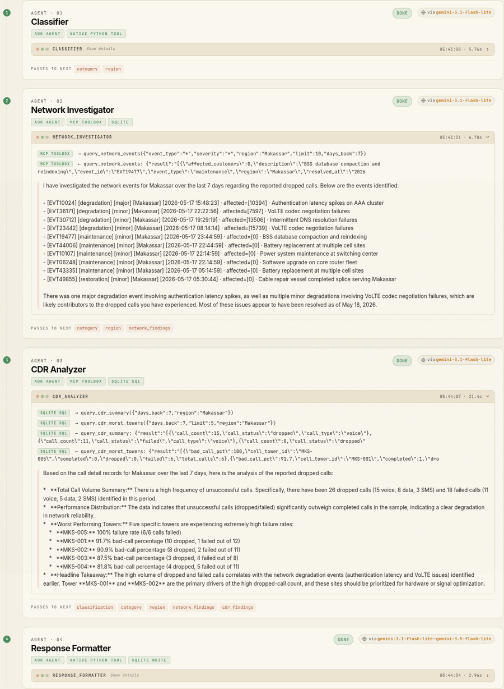
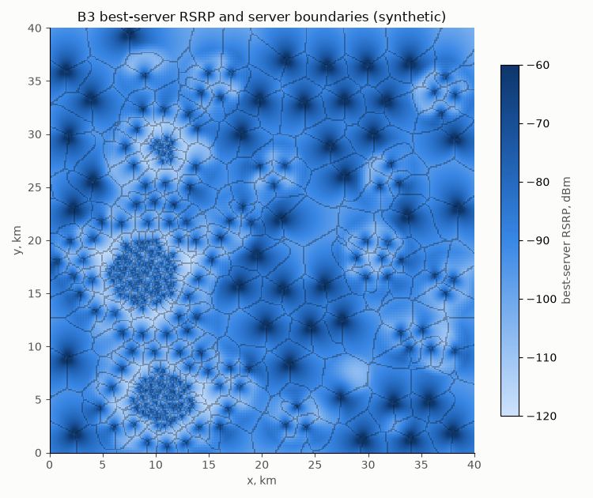
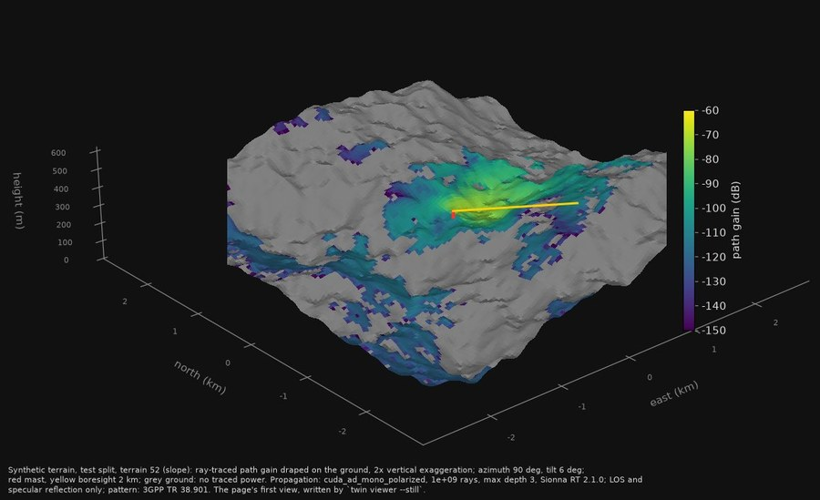
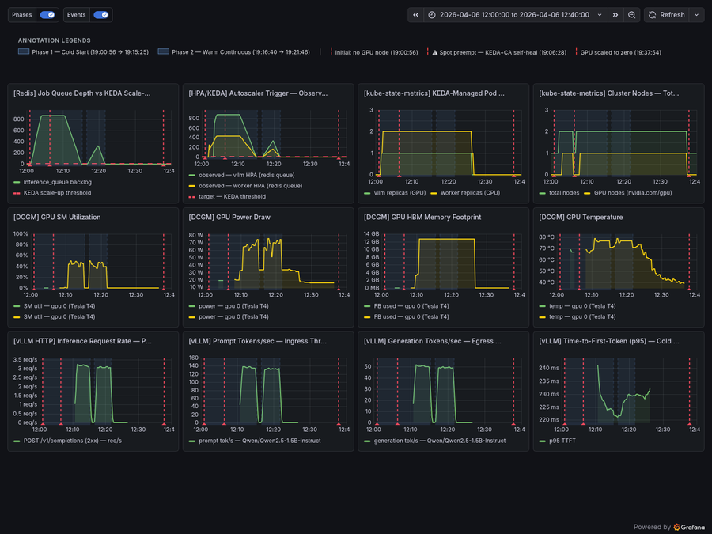
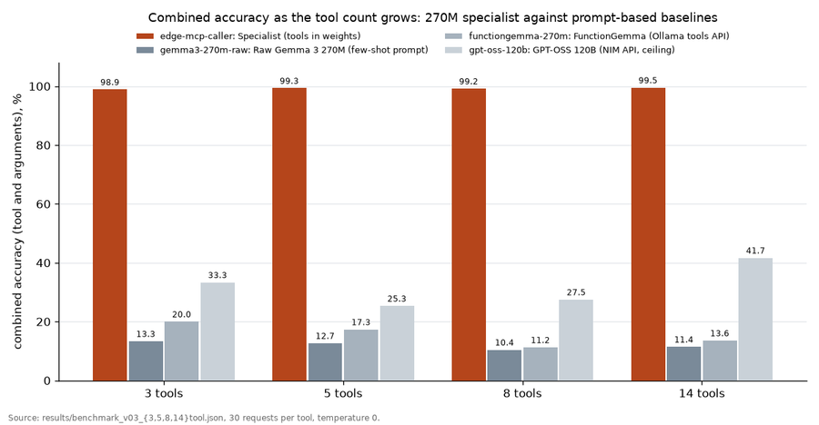

# Adityo Nugroho

**AI Engineer: system design of agentic AI, LLM serving and MLOps for telecom operations, on 18 years in mobile network performance**

> Architecture first: agent systems, data platforms, model serving and evaluation gates, each built end to end and measured. Telecom operations are the proving ground.

&nbsp;

### 1. [NetPulse AI - Multi-Agent Network Operations](https://github.com/adityonugrohoid/hackathon-telecom-ops) LIVE

**Four agents on Google Cloud turn a customer complaint into a triaged NOC incident ticket in a measured 10 to 21 seconds**

A Google ADK `SequentialAgent` runs four Gemini sub-agents on Vertex AI. MCP Toolbox is the single data gateway, switching between SQLite, AlloyDB and BigQuery by configuration, and a four-attempt model-fallback ladder rides out Vertex AI quota contention, each attempt drawing on its own quota. Live on [Cloud Run](https://netpulse-ui-670100779564.asia-southeast2.run.app/); CI runs the failover self-tests.

- **Selected Top 100** at Google Cloud Gen AI Academy APAC 2026 (Cohort 1)
- **NetPulse Perf**, a private working prototype, runs the same design on a tier-1 Indonesian mobile operator's real weekly performance data (1.3M KPI rows) and was demoed to its operations team in July 2026, ahead of a proof of concept.
- **Each card is an audit trail** of the tool call the agent made, the rows that came back and the finding it handed to the next agent, streamed to the operator as it happens. The ticket at the end carries recommended NOC actions; a person picks one, and nothing executes on its own.
- **Model failover in action**, the Response Formatter's badge reads 3.1 Flash-Lite, then 3.5 Flash-Lite during a Vertex quota squeeze mid-run. A four-attempt ladder swaps models instead of regions, since preview models are region-gated and each model carries its own quota.

 

### 2. [RAN Lakehouse - Data Foundation for Network Operations Agents](https://github.com/adityonugrohoid/ran-lakehouse)

**3GPP performance files to a versioned KPI catalog and a semver API, with the failures of real operator pipelines planted and tested**

A synthetic Indonesian multi-vendor operator (4G LTE and 2G GSM, two vendor dialects) drops performance files every 15 minutes. A bronze-silver-gold pipeline on Iceberg (Lakekeeper) and DuckDB with dbt builds the catalog, and an HTTP API under a semver contract serves KPIs, topology, network planning (OR-Tools optimization) and a what-if simulator: the platform agents like NetPulse AI need.

- **Planted and tested**: late, renamed, missing and suspect files, reprocessing and lineage, each guarded by a test; cross-checked against a public Zenodo dataset (Pearson r 0.94 on LTE)
- **151 tests**; one `docker compose` command runs the demo; CI runs the pipeline against the catalog

 

### 3. [Telecom MLOps - Drift-Gated Model Promotion for Six Use Cases](https://github.com/adityonugrohoid/telecom-mlops)

**Validate the day's data, detect drift, retrain, and promote only past a margin calibrated against a no-change control run**

Six use cases (churn, root cause, anomaly detection, QoE, capacity, network optimization) run on one contract-first loop; each owns its generator, schema and label delay. A candidate is promoted only when it beats the live model by twice the gain that retraining produces from noise alone.

- **Over a 180-day replay**, learned 6 real changes and refused every model retrained on a benign shift, with a full promotion audit trail
- **125 tests**, strict typing; CI replays 14 days of all six use cases on every push

 

### 4. [Sionna Twin - Neural Network Radio Coverage Model](https://github.com/adityonugrohoid/sionna-twin-ops)

**A U-Net that emulates the NVIDIA Sionna RT ray tracer at 1.55 dB error on unseen terrain, 133.5x faster per additional map**

Ray-traced path-gain maps with measured uncertainty feed a versioned dataset contract (5,814 maps over 126/9/9 terrains), a PyTorch U-Net learns to predict them on terrain it has never seen, and a tilt and power search runs on the model. Limitations are stated, including a mesh diffraction gap in the tracer.

- **1.55 dB** mean error against 3.13 and 3.84 dB for two classic propagation models; the search lands within 0.01 of the ray tracer's optimum in 68 to 71 of 72 cases, against 3 for a tilt rule of thumb and 15 for a fixed setting
- **159 tests**, CI in 2.5 minutes; every headline number regenerated from committed records

 

### 5. [Scale-to-Zero Inference - Two-Layer LLM Autoscaling on Kubernetes](https://github.com/adityonugrohoid/gpu-autoscale-inference)

**Event-driven, two-layer scale-to-zero serving: zero idle cost at both the pod and the node level**

KEDA scales vLLM pods on Redis queue depth, and the GKE Cluster Autoscaler scales the GPU node on pending pods. Cold start, the price of scale-to-zero, was measured and cut from about 11 to about 5.6 minutes by moving weights to a persistent volume and pre-caching the image on a secondary boot disk.

- **Full cycle recorded**: 1,762 requests end to end, including a Spot node loss and recovery
- **Observability**: 12-panel Grafana over Prometheus and NVIDIA DCGM, Locust load tests; CI lints the manifests; 30 stars, 10 forks

 

### 6. [Edge MCP Caller - Tool Knowledge in Model Weights](https://github.com/adityonugrohoid/edge-mcp-caller)

**A 270M model that carries 14 MCP tool definitions in its weights: a 20-token query returns a JSON tool call**

LoRA fine-tuning of Gemma 3 270M moves all 14 tool definitions (filesystem and git) out of the prompt and into the weights, proving the method on general tools.

- **99.5% accuracy** on 420 held-out calls, against 41.7% for GPT-OSS 120B and 13.6% for FunctionGemma with schemas in the prompt; 32x fewer prompt tokens; 153 ms on a laptop
- **Trained on one 8 GB consumer GPU** from 14,033 examples; the weights ship as a 291 MB GGUF release, and CI runs all 14 tools against real MCP servers on CPU

&nbsp;

 

Code in these repos is written with Claude Code under the author's direction, one gated pull request at a time; the author owns the architecture, the data contracts and the evaluation design.

&nbsp;

- **Location:** Surabaya, Indonesia (UTC+7), open to remote and relocation
- **LinkedIn:** [linkedin.com/in/adityonugrohoid](https://linkedin.com/in/adityonugrohoid)
- **Email:** [adityo.nugroho.id@gmail.com](mailto:adityo.nugroho.id@gmail.com)
